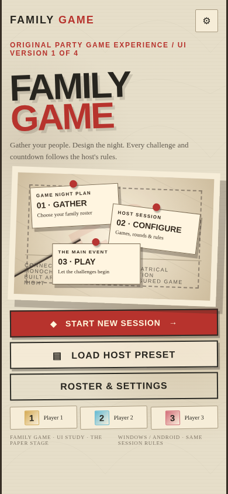

# Windows and Android adaptation

> **Status:** ACTIVE 
> **Authority:** ROUNDVEIL project decisions 
> **Product:** ROUNDVEIL — Windows + Android via Flutter/Dart 
> **Rule:** This file must not be used to revive removed features or to treat rejected prototype UX as approved.

## Product parity
Same session, game rules, content and Win Countdown on Windows and Android. Responsive layouts are **purpose-built**, not phone screen stretched to full desktop or desktop UI simply reduced in scale.

## Windows requirements
- Resizable game window plus optional fullscreen; test 1366x768, 1920x1080, 2560x1440 and windowed narrower states.
- Mouse, keyboard navigation, visible focus, text input, and convenient host controls.
- Game stage must be readable from a shared-room distance; avoid UI dominated by tiny data panes.
- Use platform-safe exit/fullscreen behavior and never let Esc accidentally lose session progress.

## Android requirements
- Touch-first composition for narrow phones and tablets, safe areas, system back and portrait/landscape adaptation.
- Tap targets at least ~48 logical dp where appropriate, scalable text, deliberate keyboard and orientation policy.
- Resume flow after call/background interruption; save session without exhausting the Win Countdown off-screen.
- Host operations must remain reachable without obstructing the character reveal or primary question.

## Style-specific geometry
Paper Stage's offset paper layers may stack vertically on phone; preserve visual character but avoid rotation-induced cropping. Hero Arena's slants/diagonals adapt to width; text stays unskewed and readable. Neither reference authorizes copying exact screenshot placement.

## Breakpoint decision
Use available constraints and orientation, not device-name flags. Design thresholds are implementation choices to test; no fixed numbers are canonized by source prototypes. Add golden tests for both visual directions in multiple sizes.

## Reference images

