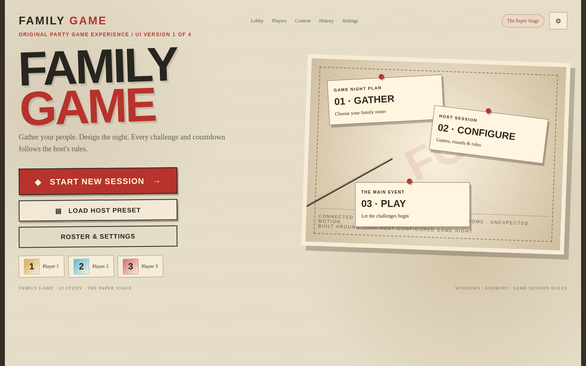
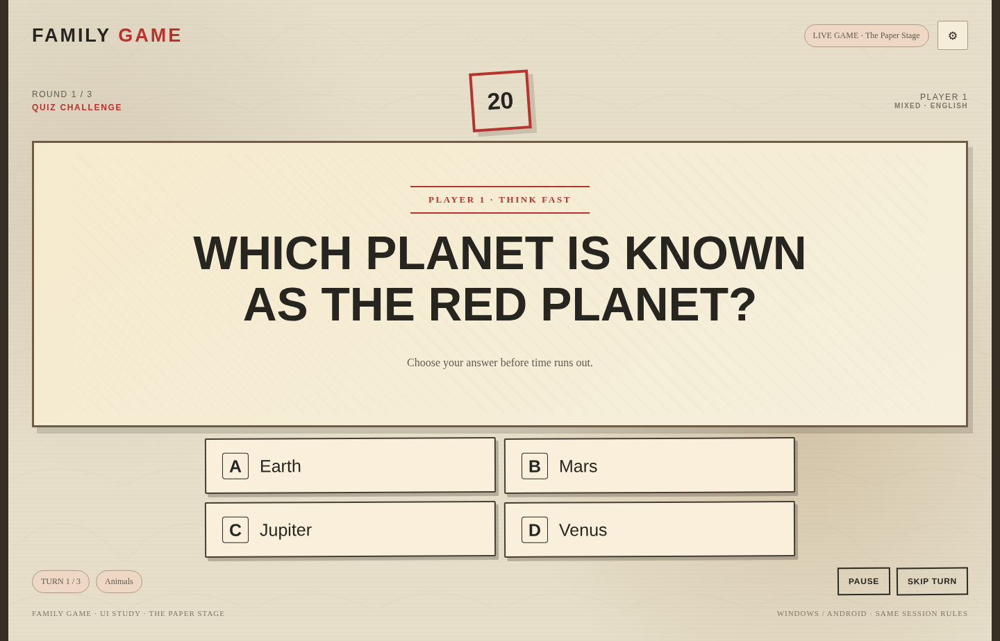

# Paper Stage — Felix-inspired visual direction

> **Status:** ACTIVE 
> **Authority:** ROUNDVEIL project decisions 
> **Product:** ROUNDVEIL — Windows + Android via Flutter/Dart 
> **Rule:** This file must not be used to revive removed features or to treat rejected prototype UX as approved.

## Visual-only inspiration
A theatrical print/paper language with warm parchment, blackened ink, deep red stamping, hard borders, odd but deliberate rotations, offset shadows and a tactile collage feeling. The user likes the look, **not the prototype's UX**. No images from the external commercial game can ship.

### Exact source-derived browser tokens
| Role | Hex / stack |
|---|---|
| Backdrop | `#E6DEC9` |
| Primary surface | `#F9EFDB` |
| Panel | `#F6EDD8` |
| Raised panel | `#E9DCC2` |
| Text | `#27251F` |
| Muted text | `#625B50` |
| Accent red | `#B7332D` |
| Secondary ink | `#252822` |
| Stroke | `#A99B81` |
| Display source stack | `Impact`, `Arial Black`, sans-serif |
| Body source stack | Georgia, serif |

### Shape/texture
Mostly angular panels, 2px token radius but square highlights, red action button with dark border, subtle 2–4° rotated decorative surfaces, paper grain, 3–7px offset shadows and dashed inner registration marks. Foreground gameplay must remain readable; reduce paper noise behind long text or large timers.

### Component mapping
- Primary button: strong flat red, ink edge, cream lettering, physical press offset.
- Selected state: unmistakable red/ink contrast and distinct focus outline.
- Title: condensed heavy caps, tight line-height; preserve actual readability.
- Countdown: very large ink/red numeral with low-distraction background; no intermediate win dialog.

### Captured reference screenshots

**WARNING:** The screenshot placement, flow and game controls are unapproved and must not be implemented directly. Full index: [`UI_COMPONENT_LIBRARY.md`](UI_COMPONENT_LIBRARY.md), [`docs/design/visual atlas`](UI_TOKENS_AND_TYPOGRAPHY.md).
