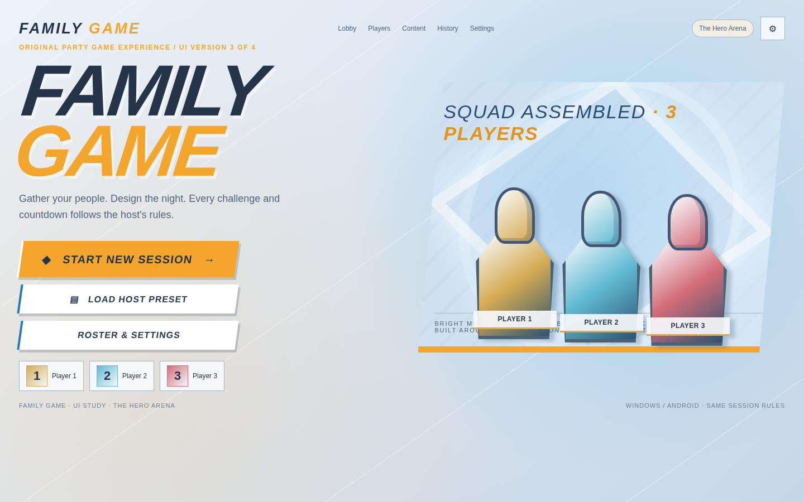
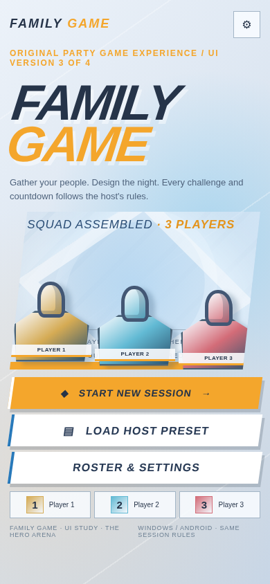
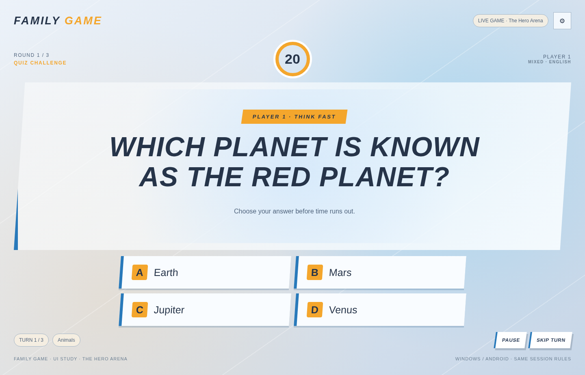

# Hero Arena — Overwatch-inspired visual direction

> **Status:** ACTIVE 
> **Authority:** ROUNDVEIL project decisions 
> **Product:** ROUNDVEIL — Windows + Android via Flutter/Dart 
> **Rule:** This file must not be used to revive removed features or to treat rejected prototype UX as approved.

## Visual-only inspiration
Bright and sharp competitive game menu styling: airy blue-gray fields, strong slanted rectangular controls, dramatic large title hierarchy, selective warm orange emphasis, crisp spacing and high legibility. These are **generic visual principles extracted from the user's HTML prototype**, not authorization to copy Overwatch assets, fonts or game UX.

### Exact source-derived browser tokens
| Role | Hex / stack |
|---|---|
| Backdrop | `#E8EDF4` |
| Surface | `#F3F7FC` |
| Panel | `#F8FBFFDE` |
| Raised panel | `#F8FBFF` |
| Text | `#263449` |
| Muted text | `#50647D` |
| Primary orange | `#F4A62C` |
| Focus blue | `#2879BA` |
| Stroke | `#A3B5C6` |
| Base corner radius | `0px` |
| Browser display stack | `Impact`, `Arial Narrow`, sans-serif |
| Browser body stack | `Trebuchet MS`, Arial, sans-serif |

### Shape/light
Angular cut-corner/slanted hero forms; interaction accents often angled about -8°. High-contrast illuminated selection frame; blue-gradient depth rather than card-stacking. Use layered lighting sparingly around important actions rather than every control.

### Component mapping
- Primary action: bright orange, dark ink text, slanted form; ensure button content text itself is not distorted.
- Secondary action: light blue-white surface, colored active border.
- Timer: bold numeric hierarchy; clocks prominent but never bigger than content unintentionally.
- Focus: visible keyboard focus state independent of hover, critical for Windows.

### Captured reference screenshots

**WARNING:** Do not replicate commercial logos, game character artwork or the source HTML's unapproved navigation/game interactions.
