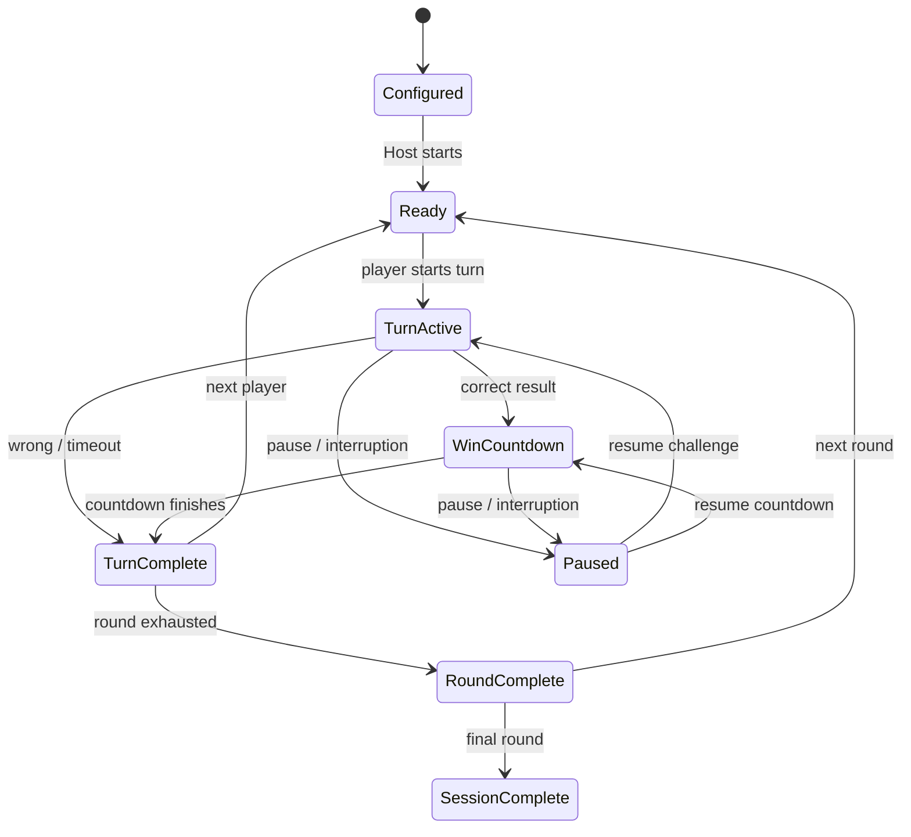

# Gameplay lifecycle and outcome flow

> **Status:** SEMANTICS ACTIVE / VISUAL UX BLOCKED 
> **Authority:** ROUNDVEIL project decisions 
> **Product:** ROUNDVEIL — Windows + Android via Flutter/Dart 
> **Rule:** This file must not be used to revive removed features or to treat rejected prototype UX as approved.

## Status boundary
**APPROVED SEMANTICS, UNAPPROVED SCREEN UX.** The state relationships below are game-engine constraints, not a license to reproduce old prototype screens. Navigation, HUD placement, confirmation overlays and host-specific transitions remain pending.

## Reference state lifecycle

Implement **explicit paused origin state** and monotonic deadlines; diagram simplifies nested states.

## Outcome precedence
Only one terminal result may settle a turn. Define arbitration when answer submission and timeout occur close together. A correct outcome schedules the Win Countdown in the **same logical transaction/state transition**; do not render a blocking winner page first. A failed or timed-out turn must never trigger the Win Countdown.

## Guess the Character special phases
`PlayerReady -> PlayerTurnsAway -> CharacterShownToClueGivers + ClueTimer -> FinalGuess + FinalGuessTimer -> HumanJudgement -> Correct/Failed`. The character stays visible until judgement, the active player stays turned away, and a Correct judgement switches immediately to countdown.

## Other modules
Quiz, Word Play, Riddles and Memory have internal phase states defined by their module specifications. GameRuntime should know only their generic success/failure and timer requests, not every game-specific UI detail.

## Guess the Country semantics
Guess the Country (Flags) owns `FlagPresented`, optional `HintRevealed`, answer submission and evaluation. Its selected flag remains stable across pause/recovery. A valid correct canonical country ID emits success; a wrong answer or challenge deadline emits failure/timeout. The module's visual answer flow remains unapproved.

## UX rejection record
Do not replicate the source HTML's particular screen ordering, demo prompts, results layout, automatic navigation, mode placement or timings. Review design candidates separately. See `docs/decisions/0003-ui-approved-ux-pending.md`.
